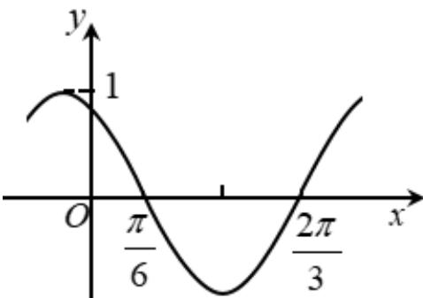

<!-- question-source:start -->
11. 下图是函数 $y = \sin(\omega x + \varphi)$ 的部分图像，则 $\sin(\omega x + \varphi) = (\quad)$

A. $\sin (x + \frac{\pi}{3})$ B. $\sin (\frac{\pi}{3} -2x)$ C. $\cos (2x + \frac{\pi}{6})$ D. $\cos (\frac{5\pi}{6} -2x)$
<!-- question-source:end -->

![[高中/真题/按年份分类/2020/2020年新高考全国卷Ⅱ数学试题_海南卷_含答案/选择题/题目/answers/Q00026464A1.md]]
