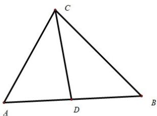

> [!faq]- 2020年新高考全国卷Ⅱ数学试题（海南卷）含答案解析
>
> > [!success]- **【答案】** C
>
> > [!note]- **【分析】**
> > 根据向量的加减法运算法则算出即可.
>
> > [!note]- **【解析】**
> > 
> >
> > $$
> > C B = C A + A B = C A + 2 A D = C A + 2 (C D - C A) = 2 C D - C A
> > $$
> >
> > 故选：C
> >
> > 【点睛】本题考查的是向量的加减法，较简单.
