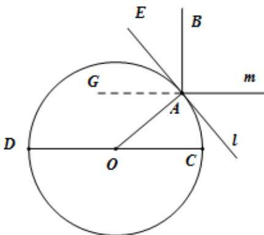

> [!faq]- 2020年新高考全国卷Ⅱ数学试题（海南卷）含答案解析
>
> > [!success]- **【答案】** B
>
> > [!note]- **【分析】**
> > 画出过球心和晷针所确定的平面截地球和晷面的截面图，根据面面平行的性质定理和线面垂直的定义判定有关截线的关系，根据点 $A$ 处的纬度，计算出晷针与点 $A$ 处的水平面所成角.
> > 【
>
> > [!note]- **【解析】**
> > 画出截面图如下图所示，其中 $CD$ 是赤道所在平面的截线； $l$ 是点 $A$ 处的水平面的截线，依题意可知 $OA \perp l$ ； $AB$ 是晷针所在直线。 $m$ 是晷面的截线，依题意依题意，晷面和赤道平面平行，晷针与晷面垂直，根据平面平行的性质定理可得可知 $m//CD$ 、根据线面垂直的定义可得 $AB \perp m$ ．由于 $\angle AOC = 40^\circ, m//CD$ ，所以 $\angle OAG = \angle AOC = 40^\circ$ ，由于 $\angle OAG + \angle GAE = \angle BAE + \angle GAE = 90^\circ$ ，所以 $\angle BAE = \angle OAG = 40^\circ$ ，也即晷针与点 $A$ 处的水平面所成角为 $\angle BAE = 40^\circ$ ．
> >
> > 故选：B
> >
> > 
> >
> > 【点睛】本小题主要考查中国古代数学文化，考查球体有关计算，涉及平面平行，线面垂直的性质，属于中档题.
