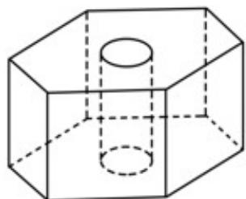

<!-- question-source:start -->
9.如图, 六角螺帽毛坯是由一个正六棱柱挖去一个圆柱所构成的. 已知螺帽的底面正六边形边长为 $2 \mathrm{~cm}$ , 高为 $2 \mathrm{~cm}$ , 内孔半轻为 $0.5 \mathrm{~cm}$ , 则此六角螺帽毛坯的体积是\_\_\_\_cm.

<!-- question-source:end -->

![[高中/真题/按年份分类/2020/2020年江苏高考数学试题及答案/填空题/题目/answers/Q00027588A1.md]]
