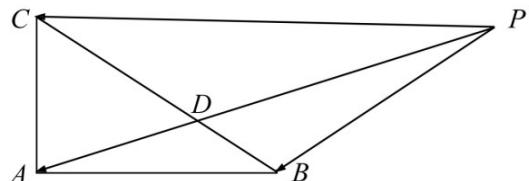

<!-- question-source:start -->
13. 在 $\triangle ABC$ 中， $AB = 4, AC = 3, \angle BAC = 90^\circ D$ 在边 $BC$ 上，延长 $AD$ 到 $P$ ，使得 $AP = 9$ ，若

$PA = mPB + \left( \frac{3}{2} - m \right)PC \quad (m \text{ 为常数})$ ，则 $CD$ 的长度是\_\_\_\_.

<!-- question-source:end -->

![[高中/真题/按年份分类/2020/2020年江苏高考数学试题及答案/填空题/题目/answers/Q00027592A1.md]]
