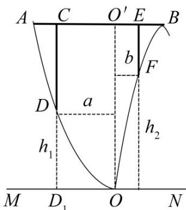

<!-- question-source:start -->
17. 某地准备在山谷中建一座桥梁，桥址位置的竖直截面图如图所示：谷底 O 在水平线 MN 上、桥 AB 与 MN 平行， $OO'$ 为铅垂线 ( $O'$ 在 AB 上). 经测量，左侧曲线 AO 上任一点 D 到 MN 的距离 $h_{1}$ (米) 与 D 到 $OO'$ 的距离 a (米) 之间满足关系式 $h_{1} = \frac{1}{40} a^{2}$ ; 右侧曲线 BO 上任一点 F 到 MN 的距离 $h_{2}$ (米) 与 F 到 $OO'$ 的距离 b (米) 之间满足关系式 $h_{2} = -\frac{1}{800} b^{3} + 6b$ . 已知点 B 到 $OO'$ 的距离为 40 米.

<!-- question-source:end -->

![[高中/真题/按年份分类/2020/2020年江苏高考数学试题及答案/填空题/题目/answers/Q00029141A1.md]]
