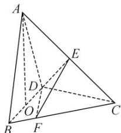

<!-- question-source:start -->
24. 在三棱锥 $A - BCD$ 中, 已知 $CB = CD = \sqrt{5}$ , $BD = 2$ , $O$ 为 $BD$ 的中点, $AO \perp$ 平面 $BCD$ , $AO = 2$ , $E$ 为 $AC$ 的中点.

<!-- question-source:end -->

![[高中/真题/按年份分类/2020/2020年江苏高考数学试题及答案/填空题/题目/answers/Q00029147A1.md]]
