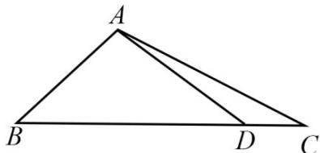

<!-- question-source:start -->
16. 在 $\triangle ABC$ 中，角 $A, B, C$ 的对边分别为 $a, b, c$ ，已知 $a = 3, c = \sqrt{2}, B = 45^{\circ}$

(1) 求 $\sin C$ 的值；
<!-- question-source:end -->

![[高中/真题/按年份分类/2020/2020年江苏高考数学试题及答案/填空题/题目/answers/Q00031053A1.md]]
