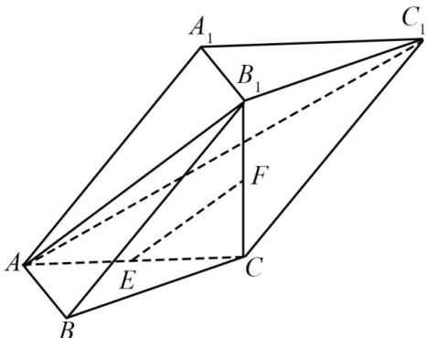

<!-- question-source:start -->
15. 在三棱柱 $ABC-A_{1}B_{1}C_{1}$ 中， $AB \perp AC$ ， $B_{1}C \perp$ 平面 ABC，E，F 分别是 AC， $B_{1}C$ 的中点.

(1) 求证: $EF\|$ 平面 $AB_{1}C_{1}$ ;

(2) 求证: 平面 $AB_{1}C \perp$ 平面 $ABB_{1}$ .
<!-- question-source:end -->

![[高中/真题/按年份分类/2020/2020年江苏高考数学试题及答案/解答题/题目/answers/Q00027594A1.md]]
