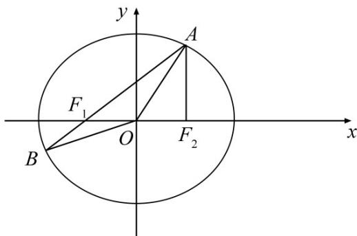

<!-- question-source:start -->
18.在平面直角坐标系 $xOy$ 中，已知椭圆 $E:\frac{x^2}{4} +\frac{y^2}{3} = 1$ 的左、右焦点分别为 $F_{1},F_{2}$ ，点 $A$ 在椭圆 $E$ 上且在第一象限内， $AF_{2}\bot F_{1}F_{2}$ ，直线 $AF_{1}$ 与椭圆 $E$ 相交于另一点 $B$

(1) 求 $\triangle AF_{1}F_{2}$ 的周长；

(2) 在 x 轴上任取一点 P，直线 AP 与椭圆 E 的右准线相交于点 Q，求 $OP \cdot QP$ 的最小值；

(3) 设点 M 在椭圆 E 上，记 $\triangle OAB$ 与 $\triangle MAB$ 的面积分别为 $S_{1}$ ， $S_{2}$ ，若 $S_{2}=3S_{1}$ ，求点 M 的坐标.
<!-- question-source:end -->

![[高中/真题/按年份分类/2020/2020年江苏高考数学试题及答案/解答题/题目/answers/Q00027597A1.md]]
