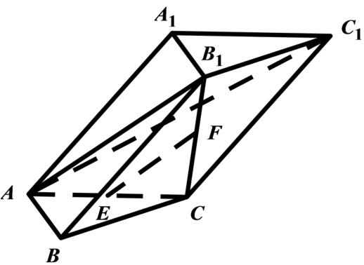

> [!faq]- 2020年江苏高考数学试题及答案解析
>
> > [!success]- **【答案】** （1）证明详见
>
> > [!note]- **【分析】**
> > (1) 通过证明 $EF // AB_{1}$ , 来证得 $EF //$ 平面 $AB_{1}C_{1}$ .
> > (2) 通过证明 $AB \perp$ 平面 $AB_{1}C$ ，来证得平面 $AB_{1}C \perp$ 平面 $ABB_{1}$ .
>
> > [!note]- **【解析】**
> > （1）由于 $E, F$ 分别是 $AC, B_{1}C$ 的中点，所以 $EF // AB_{1}$ .
> >
> > 由于 $EF \notin$ 平面 $AB_{1}C_{1}, AB_{1} \subset$ 平面 $AB_{1}C_{1}$ ，所以 $EF //$ 平面 $AB_{1}C_{1}$ .
> > （2）由于 $B_{1}C \perp$ 平面 $ABC, AB\dot{I}$ 平面 $ABC$ ，所以 $B_{1}C \perp AB$ .
> >
> > 由于 $AB \perp AC, AC \cap B_{1}C = C$ ，所以 $AB \perp$ 平面 $AB_{1}C$ ,
> >
> > 由于 $AB\dot{I}$ 平面 $ABB_{1}$ ，所以平面 $AB_{1}C \perp$ 平面 $ABB_{1}$ .
> >
> > 
> >
> > 【点睛】本小题主要考查线面平行的证明，考查面面垂直的证明，属于中档题.
