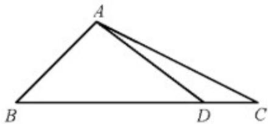

> [!faq]- 2020年江苏高考数学试题及答案解析
>
> > [!success]- **【答案】** (1) $\sin C = \frac{\sqrt{5}}{5}$ ; (2) $\tan \angle DAC = \frac{2}{11}$ . 【
>
> > [!note]- **【分析】**
> > (1) 利用余弦定理求得 b，利用正弦定理求得 $\sin C$ .
> > (2) 根据 $\cos\angle ADC$ 的值, 求得 $\sin\angle ADC$ 的值, 由
> > (1) 求得 $\cos C$ 的值, 从而求得 $\sin\angle DAC, \cos\angle DAC$
>
> > [!note]- **【解析】**
> > （1）由余弦定理得 $b^{2}=a^{2}+c^{2}-2ac\cos B=9+2-2\times3\times\sqrt{2}\times\frac{\sqrt{2}}{2}=5$ ，所以 $b=\sqrt{5}$
> >
> > 由正弦定理得 $\frac{c}{\sin C} = \frac{b}{\sin B} \Rightarrow \sin C = \frac{c \sin B}{b} = \frac{\sqrt{5}}{5}$ .
> > (2) 由于 $\cos \angle ADC = -\frac{4}{5}$ , $\angle ADC \in \left(\frac{\pi}{2}, \pi\right)$ , 所以 $\sin \angle ADC = \sqrt{1 - \cos^2 \angle ADC} = \frac{3}{5}$ .
> >
> > 由于 $\angle ADC\in \left(\frac{\pi}{2},\pi\right)$ ，所以 $C\in \left(0,\frac{\pi}{2}\right)$ ，所以 $\cos C = \sqrt{1 - \sin^2C} = \frac{2\sqrt{5}}{5}$
> >
> > 所以 $\sin\angle DAC=\sin(\pi-\angle DAC)=\sin(\angle ADC+\angle C)$
> >
> > $= \sin \angle ADC\cdot \cos C + \cos \angle ADC\cdot \sin C = \frac{3}{5}\times \frac{2\sqrt{5}}{5} +\left(-\frac{4}{5}\right)\times \frac{\sqrt{5}}{5} = \frac{2\sqrt{5}}{25}.$
> >
> > 由于 $\angle DAC\in \left(0,\frac{\pi}{2}\right)$ ，所以 $\cos \angle DAC = \sqrt{1 - \sin^2\angle DAC} = \frac{11\sqrt{5}}{25}.$
> >
> > 所以 $\tan\angle DAC=\frac{\sin\angle DAC}{\cos\angle DAC}=\frac{2}{11}.$
> >
> > 
> >
> > 【点睛】本小题主要考查正弦定理、余弦定理解三角形，考查三角恒等变换，属于中档题.
