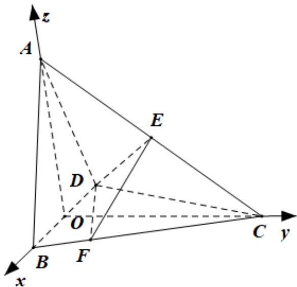

> [!faq]- 2020年江苏高考数学试题及答案解析
>
> > [!success]- **【答案】** (1) $\frac{\sqrt{15}}{15}$ (2) $\frac{2\sqrt{39}}{13}$ 【
>
> > [!note]- **【分析】**
> > (1) 建立空间直角坐标系，利用向量数量积求直线向量夹角，即得结果；
>
> > [!note]- **【解析】**
> > 
> >
> > (1) 连 $CO \mathsf{Q} BC = CD, BO = OD \therefore CO \perp BD$
> >
> > 以 $OB, OC, OA$ 为 $x, y, z$ 轴建立空间直角坐标系，则 $A(0,0,2), B(1,0,0), C(0,2,0), D(-1,0,0) \therefore E(0,1,1)$
> >
> > $$
> > \therefore A B = (1, 0, - 2), D E = (1, 1, 1) \therefore \cos <   A B, D E > = \frac {- 1}{\sqrt {5} \sqrt {3}} = - \frac {\sqrt {1 5}}{1 5}
> > $$
> >
> > 从而直线 $AB$ 与 $DE$ 所成角的余弦值为 $\frac{\sqrt{15}}{15}$
> >
> > (2) 设平面 $DEC$ 一个法向量为 $n_1 = (x, y, z)$ ,
> >
> > $$
> > \because D C = (1, 2, 0), \left\{ \begin{array}{l} n _ {1} \cdot D C = 0 \\ n _ {1} \cdot D E = 0 \end{array} \right. \therefore \left\{ \begin{array}{l} x + 2 y = 0 \\ x + y + z = 0 \end{array} \right.
> > $$
> >
> > $$
> > \text {令} y = 1 \therefore x = - 2, z = 1 \therefore n _ {1} = (- 2, 1, 1)
> > $$
> >
> > 设平面 $DEF$ 一个法向量为 $n_2 = (x_1, y_1, z_1)$ ,
> >
> > $$
> > \because D F = D B + B F = D B + \frac {1}{4} B C = (\frac {7}{4}, \frac {1}{2}, 0), \left\{ \begin{array}{l} n _ {2} \cdot D F = 0 \\ n _ {2} \cdot D E = 0 \end{array} \right. \therefore \left\{ \begin{array}{l} \frac {7}{4} x _ {1} + \frac {1}{2} y _ {1} = 0 \\ x _ {1} + y _ {1} + z _ {1} = 0 \end{array} \right.
> > $$
> >
> > 令 $y_{1}=-7\therefore x_{1}=2,z_{1}=5\therefore n_{2}=(2,-7,5)$
> >
> > $$
> > \therefore \cos <   n _ {1}, n _ {2} > = \frac {- 6}{\sqrt {6} \sqrt {7 8}} = - \frac {1}{\sqrt {1 3}}
> > $$
> >
> > 因此 $\sin\theta=\frac{\sqrt{12}}{\sqrt{13}}=\frac{2\sqrt{39}}{13}$
> >
> > 【点睛】本题考查利用向量求线线角与二面角，考查基本
