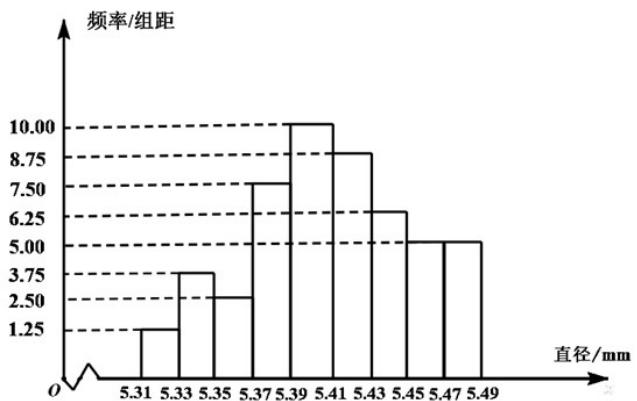

绝密★启用前

# 2020 年普通高等学校招生全国统一考试（天津卷）

# 数学

本试卷分为第Ⅰ卷（选择题）和第Ⅱ卷（非选择题）两部分，共150分，考试用时120分钟.
第Ⅰ卷1至3页，第Ⅱ卷4至6页.

答卷前，考生务必将自己的姓名、考生号、考场号和座位号填写在答题卡上，并在规定位置粘贴考试用条形码。答卷时，考生务必将
答案涂写在答题卡上，答在试卷上的无效。考试结束后，将本试卷和答题卡一并交回。

祝各位考生考试顺利！

## 第I卷

## 注意事项：

1. 每小题选出
答案后，用铅笔将答题卡上对应题目的
答案标号涂黑。如需改动，用橡皮擦干净后，再选涂其他
答案标号。

2. 本卷共9小题，每小题5分，共45分.

参考公式:

如果事件 A 与事件 B 互斥，那么 $P(A \cup B) = P(A) + P(B)$ .

如果事件 A 与事件 B 相互独立，那么 $P(AB)=P(A)P(B)$ .

球的表面积公式 $S = 4\pi R^2$ ，其中 $R$ 表示球的半径.

##
一、选择题：在每小题给出的四个选项中，只有一项是符合题目要求的。

1.设全集 $U = \{-3, - 2, - 1,0,1,2,3\}$ ，集合 $A = \{-1,0,1,2\},\quad B = \{-3,0,2,3\}$ ，则 $A\cap (\check{\mathfrak{Q}}_U B) =$ （ ）A. $\{-3,3\}$ B. $\{0,2\}$ C. $\{-1,1\}$ D. $\{-3, - 2, - 1,1,3\}$

2. 设 $a \in R$ ，则“ $a > 1$ ”是“ $a^{2} > a$ ”的（）

A. 充分不必要条件 B. 必要不充分条件 C. 充要条件 D. 既不充分也不必要条件

3. 函数 $y = \frac{4x}{x^{2} + 1}$ 的图象大致为（）

A  

B.  

C.  

D.  

4.从一批零件中抽取80个，测量其直径（单位：mm），将所得数据分为9组：
[5.31,5.33), [5.33,5.35), …, [5.45,5.47], [5.47,5.49]，并整理得到如下频率分布直方图，则在被抽取的零件中，直径落在区间 $^{[5.43,5.47)}$ 内的个数为（）

A. 10 B. 18 C. 20 D. 36

5.若棱长为 $2\sqrt{3}$ 的正方体的顶点都在同一球面上，则该球的表面积为（）
A. $12\pi$ B. $24\pi$ C. $36\pi$ D. $144\pi$

6.设 $a = 3^{0.7}$ ， $b = \left(\frac{1}{3}\right)^{-0.8}$ ， $c = \log_{0.7}0.8$ ，则 $a,b,c$ 的大小关系为（）

A. $a < b < c$ B. $b < a < c$ C. $b < c < a$ D. $c < a < b$

7. 设双曲线 C 的方程为 $\frac{x^{2}}{a^{2}} - \frac{y^{2}}{b^{2}} = 1 (a > 0, b > 0)$ ，过抛物线 $y^{2} = 4x$ 的焦点和点 $(0, b)$ 的直线为 l．若 C 的一条渐近线与 l 平行，另一条渐近线与 l 垂直，则双曲线 C 的方程为（）
A. $\frac{x^{2}}{4}-\frac{y^{2}}{4}=1$ B. $x^{2}-\frac{y^{2}}{4}=1$ C. $\frac{x^{2}}{4}-y^{2}=1$ D. $x^{2}-y^{2}=1$

8.已知函数 $f(x)=\sin\left(x+\frac{\pi}{3}\right)$ 。给出下列结论：
① $f(x)$ 的最小正周期为 $2\pi$ ;
② $f\left(\frac{\pi}{2}\right)$ 是 $f(x)$ 的最大值；

③ 把函数 $y = \sin x$ 的图象上所有点向左平移 $\frac{\pi}{3}$ 个单位长度，可得到函数 $y = f(x)$ 的图象。其中所有正确结论的序号是
A. ① B. ①③ C. ②③ D. ①②③

9. 已知函数 $f(x)=\left\{\begin{aligned} x^{3}, & \quad x...0, \\ -x, & \quad x<0. \end{aligned}\right.$ 若函数 $g(x)=f(x)-\left|kx^{2}-2x\right|$ $(k\in\mathbf{R})$ 恰有 4 个零点，则 $k$ 的取值范围是（）

A. $\left(-\infty,-\frac{1}{2}\right)\cup(2\sqrt{2},+\infty)$ B. $\left(-\infty,-\frac{1}{2}\right)\cup(0,2\sqrt{2})$ C. $(-∞,0)\cup(0,2\sqrt{2})$ D. $(-∞,0)\cup(2\sqrt{2},+\infty)$

绝密★启用前

# 2020年普通高等学校招生全国统一考试（天津卷）

数学

第Ⅱ卷

注意事项：

1. 用黑色墨水的钢笔或签字笔将
答案写在答题卡上。

2. 本卷共11小题，共105分.

##

![[高中/真题/按年份分类/2020/2020年高考数学试题_天津卷_及参考答案/填空题/填空题.md]]
![[高中/真题/按年份分类/2020/2020年高考数学试题_天津卷_及参考答案/选择题/选择题.md]]
![[高中/真题/按年份分类/2020/2020年高考数学试题_天津卷_及参考答案/解答题/解答题.md]]
