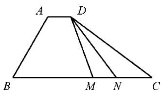

<!-- question-source:start -->
15.如图, 在四边形 $ABCD$ 中, $\angle B = 60^{\circ}$ , $AB = 3$ , $BC = 6$ , 且 $AD = \lambda BC$ , $AD \cdot AB = -\frac{3}{2}$ , 则实数 $\lambda$ 的值为 , 若 $M, N$ 是线段 $BC$ 上的动点, 且 $|MN| = 1$ , 则 $DM \cdot DN$ 的最小值为 .

##
<!-- question-source:end -->

![[高中/真题/按年份分类/2020/2020年高考数学试题_天津卷_及参考答案/填空题/题目/answers/Q00029526A1.md]]
