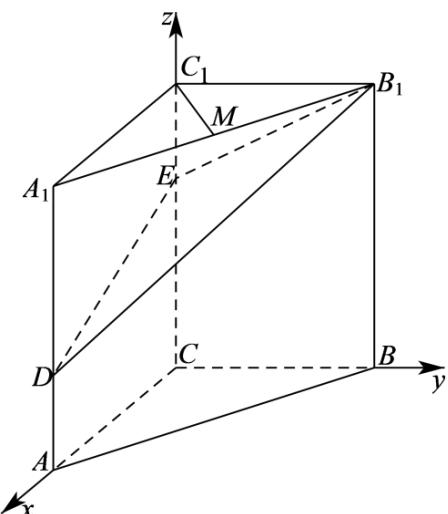

> [!faq]- 2020年高考数学试题(天津卷)及参考答案解析
>
> > [!success]- **【答案】** （I）证明见
>
> > [!note]- **【分析】**
> > 以 C 为原点，分别以 CA, CB, $CC_{1}$ 的方向为 x 轴，y 轴，z 轴的正方向建立空间直角坐标系.
>
> > [!note]- **【解析】**
> > 依题意，以 C 为原点，分别以 CA、CB、 $CC_{1}$ 的方向为 x 轴、y 轴、z 轴的正方向建立空间直角坐标系（如图），
> >
> > 
> >
> > 可得 $C(0,0,0)$ 、 $A(2,0,0)$ 、 $B(0,2,0)$ 、 $C_{1}(0,0,3)$
> >
> > $A_{1}(2,0,3)$ 、 $B_{1}(0,2,3)$ 、 $D(2,0,1)$ 、 $E(0,0,2)$ 、 $M(1,1,3)$
> >
> > (I) 依题意， $C_{1}M=(1,1,0)$ ， $B_{1}D=(2,-2,-2)$
> >
> > 从而 $C_{1}M \cdot B_{1}D = 2 - 2 + 0 = 0$ ，所以 $C_{1}M \perp B_{1}D$ ；
> >
> > （Ⅱ）依题意， $CA = (2,0,0)$ 是平面 $BB_{1}E$ 的一个法向量， $EB_{1} = (0,2,1), ED = (2,0,-1)$ .
> >
> > 设 $n = (x,y,z)$ 为平面 $DB_{1}E$ 的法向量，
> >
> > 则 $\left\{ \begin{array}{l} n \cdot EB_{1} = 0 \\ n \cdot ED = 0 \end{array} \right.$ ，即 $\left\{ \begin{array}{l} 2y + z = 0 \\ 2x - z = 0 \end{array} \right.$ ，
> >
> > 不妨设 x=1，可得 $n=(1,-1,2)$ .
> >
> > $$
> > \cos <   C A, n > = \frac {C A \cdot n}{| C A | \cdot | n |} = \frac {2}{2 \times \sqrt {6}} = \frac {\sqrt {6}}{6},
> > $$
> >
> > $$
> > \therefore \sin <   C A, n > = \sqrt {1 - \cos^ {2} <   C A , n >} = \frac {\sqrt {3 0}}{6}.
> > $$
> >
> > 所以，二面角 $B - B_{1}E - D$ 的正弦值为 $\frac{\sqrt{30}}{6}$ ;
> >
> > (III) 依题意， $AB=(-2,2,0)$ .
> >
> > 由（Ⅱ）知 $n=(1,-1,2)$ 为平面 $DB_{1}E$ 的一个法向量，于是 $\cos\langle AB,n\rangle=\frac{AB\cdot n}{|AB|\cdot|n|}=\frac{-4}{2\sqrt{2}\times\sqrt{6}}=-\frac{\sqrt{3}}{3}$ .
> > 所以，直线 $AB$ 与平面 $DB_{1}E$ 所成角的正弦值为 $\frac{\sqrt{3}}{3}$ .
> >
> > 【点睛】本题考查利用空间向量法证明线线垂直，求二面角和线面角的正弦值，考查推理能力与计算能力，属于中档题.
