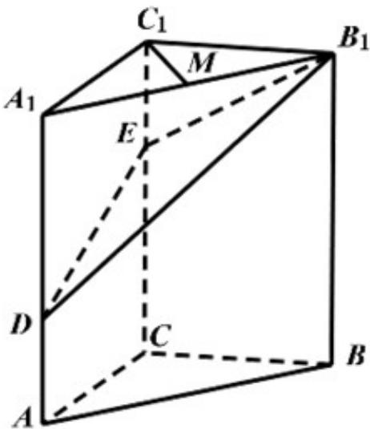

<!-- question-source:start -->
17.如图，在三棱柱 $ABC-A_{1}B_{1}C_{1}$ 中， $CC_{1}\perp$ 平面ABC,AC⊥BC,AC=BC=2， $CC_{1}=3$ ，点D，E 分别在棱 $AA_{1}$ 和棱 $CC_{1}$ 上，且AD=1 CE=2，M为棱 $A_{1}B_{1}$ 的中点.

(I) 求证: $C_{1}M \perp B_{1}D$ ;

（Ⅱ）求二面角 $B - B_{1}E - D$ 的正弦值；

(III) 求直线 $AB$ 与平面 $DB_{1}E$ 所成角的正弦值.
<!-- question-source:end -->

![[高中/真题/按年份分类/2020/2020年高考数学试题_天津卷_及参考答案/解答题/题目/answers/Q00022794A1.md]]
