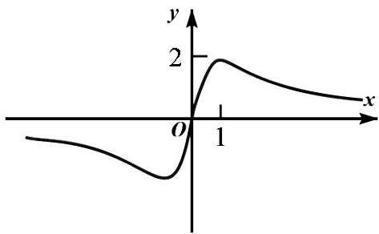
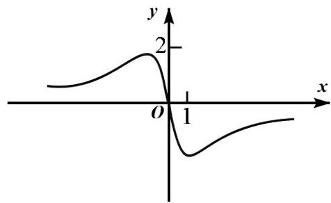
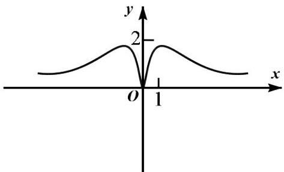
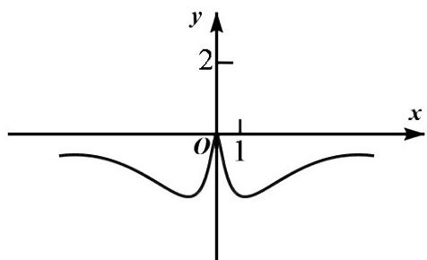

<!-- question-source:start -->
3. 函数 $y = \frac{4x}{x^{2} + 1}$ 的图象大致为（）

A  

B.  

C.  

D.  

<!-- question-source:end -->

![[高中/真题/按年份分类/2020/2020年高考数学试题_天津卷_及参考答案/选择题/题目/answers/Q00022780A1.md]]
