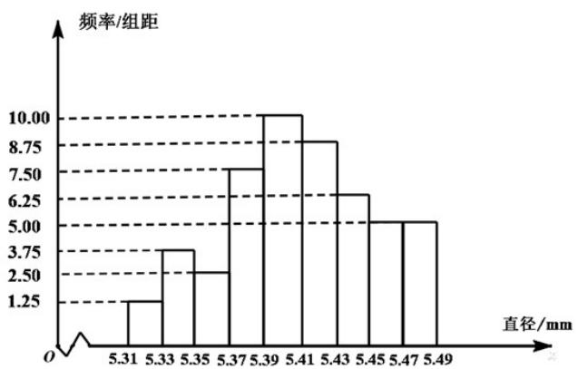

<!-- question-source:start -->
4.从一批零件中抽取80个，测量其直径（单位：mm），将所得数据分为9组：
[5.31,5.33), [5.33,5.35), …, [5.45,5.47], [5.47,5.49]，并整理得到如下频率分布直方图，则在被抽取的零件中，直径落在区间 $^{[5.43,5.47]}$ 内的个数为（）

A. 10 B. 18 C. 20 D. 36

根据直方图确定直径落在区间 $[5.43, 5.47)$ 之间的零件频率，然后结合样本总数计算其个数即可.
<!-- question-source:end -->

![[高中/真题/按年份分类/2020/2020年高考数学试题_天津卷_及参考答案/选择题/题目/answers/Q00031217A1.md]]
