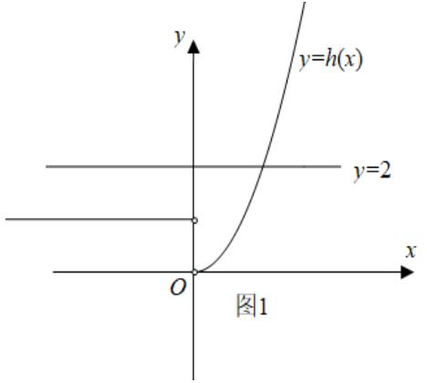
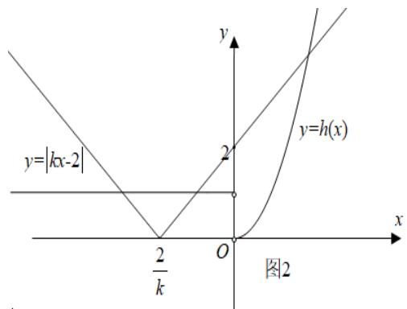
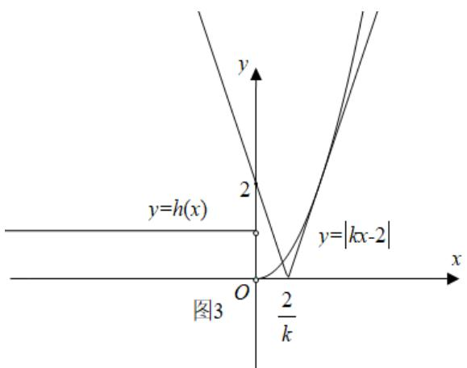

> [!faq]- 2020年高考数学试题(天津卷)及参考答案解析
>
> > [!success]- **【答案】** D
>
> > [!note]- **【分析】**
> > 由 $g(0)=0$ ，结合已知，将问题转化为 $y\models kx-2|$ 与 $h(x)=\frac{f(x)}{|x|}$ 有 3 个不同交点，分 k=0, k<0, k>0
>
> > [!note]- **【解析】**
> > 注意到 $g(0)=0$ ，所以要使 $g(x)$ 恰有 4 个零点，只需方程 $|kx-2|= \frac{f(x)}{|x|}$ 恰有 3 个实根即可，
> >
> > 令 $h(x)=\frac{f(x)}{|x|}$ ，即 $y\models kx-2|$ 与 $h(x)=\frac{f(x)}{|x|}$ 的图象有 3 个不同交点.
> >
> > 因为 $h(x)=\frac{f(x)}{|x|}=\left\{\begin{aligned}&x^{2},&x>0\\ &1,&x<0,\end{aligned}\right.$ 当 k=0 时，此时 y=2，如图 1，y=2 与 $h(x)=\frac{f(x)}{|x|}$ 有 2 个不同交点，不满足题意；
> >
> > 当 k<0 时，如图 2，此时 $y\models kx-2|$ 与 $h(x)=\frac{f(x)}{|x|}$ 恒有 3 个不同交点，满足题意；
> >
> > 当 k>0 时，如图 3，当 $y=kx-2|$ 与 $y=x^{2}$ 相切时，联立方程得 $x^{2}-kx+2=0$ ，
> >
> > 令 $\Delta=0$ 得 $k^{2}-8=0$ ，解得 $k=2\sqrt{2}$ （负值舍去），所以 $k>2\sqrt{2}$ .
> >
> > 综上， $k$ 的取值范围为 $(-\infty ,0)\cup (2\sqrt{2}, + \infty)$
> >
> > 故选：D.
> >
> > 
> >
> > 
> >
> > 
> >
> > 【点睛】本题主要考查函数与方程的应用，考查数形结合思想，转化与化归思想，是一道中档题.绝密★启用前
> >
> > 2020 年普通高等学校招生全国统一考试（天津卷）
> >
> > 数学
> >
> > 第Ⅱ卷
> >
> > ## 注意事项：
> >
> > 1. 用黑色墨水的钢笔或签字笔将答案写在答题卡上。
