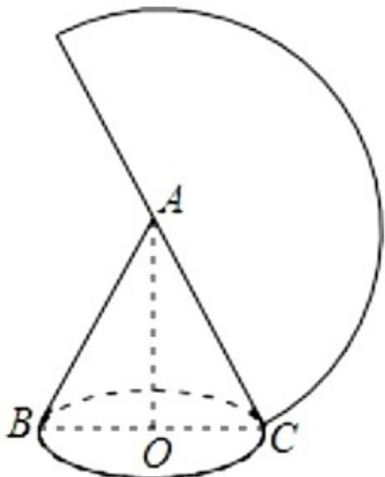

> [!faq]- 2020年高考浙江高考数学试题及答案(精校版)解析
>
> > [!success]- **【答案】** 1
>
> > [!note]- **【分析】**
> > 利用圆锥的侧面积，求出母线长，求解底面圆的周长，然后求解底面半径.
>
> > [!note]- **【解析】**
> > 【分析】利用圆锥的侧面积，求出母线长，求解底面圆的周长，然后求解底面半径.
> >
> > 解：∵圆锥侧面展开图是半圆，面积为2π，
> >
> > 
> >
> > 设圆锥的母线长为 $a$ ，则 $\frac{1}{2} \times a 2\pi = 2\pi$ ， $\therefore a = 2$
> >
> > ∴侧面展开扇形的弧长为 $2\pi$ ,
> >
> > 设圆锥的底面半径 OC=r，则 $2\pi r=2\pi$ ，解得 r=1。
> >
> > 故答案为：1.
