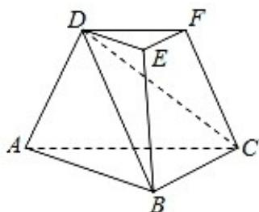

<!-- question-source:start -->
19. 如图，三棱台 $DEF - ABC$ 中，面 $ADFC \perp$ 面 $ABC$ ， $\angle ACB = \angle ACD = 45^\circ$ ， $DC = 2BC$ 。

(Ⅰ) 证明: $EF \perp DB$ ;

（Ⅱ）求 $DF$ 与面 $DBC$ 所成角的正弦值.

<!-- question-source:end -->

![[高中/真题/按年份分类/2020/2020年高考浙江高考数学试题及答案_精校版_/解答题/题目/answers/Q00022730A1.md]]
