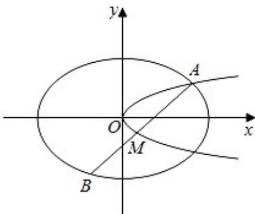

<!-- question-source:start -->
21. 如图, 已知椭圆 $C1: \frac{x^2}{2} + y2 = 1$ , 抛物线 $C2: y2 = 2px (p > 0)$ , 点 $A$ 是椭圆 $C1$ 与抛物线 $C2$ 的交点, 过点 $A$ 的直线 $l$ 交椭圆 $C1$ 于点 $B$ , 交抛物线 $C2$ 于 $M(B, M$ 不同于 $A)$ .

（Ⅰ）若 $p = \frac{1}{16}$ ，求抛物线 $C2$ 的焦点坐标；

（Ⅱ）若存在不过原点的直线 l 使 M 为线段 AB 的中点，求 p 的最大值.

<!-- question-source:end -->

![[高中/真题/按年份分类/2020/2020年高考浙江高考数学试题及答案_精校版_/解答题/题目/answers/Q00022732A1.md]]
