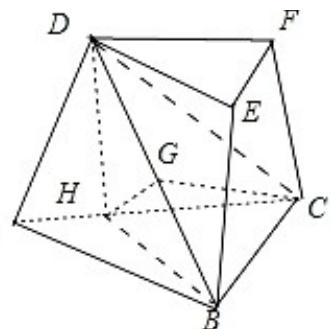

> [!faq]- 2020年高考浙江高考数学试题及答案(精校版)解析
>
> > [!success]- **【答案】** 详见解析
>
> > [!note]- **【分析】**
> > （Ⅰ）题根据已知条件，作 $DH \perp AC$ ，根据面面垂直，可得 $DH \perp BC$ ，进一步根据直角三角形的知识可判断出 $\triangle BHC$ 是直角三角形，且 $\angle HBC = 90^{\circ}$ ，则 $HB \perp BC$ ，从而可证出 $BC \perp$ 面 DHB，最后根据棱台的定义有 $EF \parallel BC$ ，根据平行线的性质可得 $EF \perp DB$ ；
>
> > [!note]- **【解析】**
> > 分析】（Ⅰ）题根据已知条件，作 $DH \perp AC$ ，根据面面垂直，可得 $DH \perp BC$ ，进一步根据直角三角形的知识可判断出 $\triangle BHC$ 是直角三角形，且 $\angle HBC = 90^{\circ}$ ，则 $HB \perp BC$ ，从而可证出 $BC \perp$ 面 DHB，最后根据棱台的定义有 $EF \parallel BC$ ，根据平行线的性质可得 $EF \perp DB$ ；
> >
> > （Ⅱ）题先可设 BC=1，根据解直角三角形可得 BH=1, $HC=\sqrt{2}$ , $DH=\sqrt{2}$ , DC=2, DB= $\sqrt{3}$ ，然后找到 CH 与面 DBC 的夹角即为 $\angle HCG$ ，根据棱台的特点可知 DF 与面 DBC 所成角与 CH 与面 DBC 的夹角相等，通过计算 $\angle HCG$ 的正弦值，即可得到 DF 与面 DBC 所成角的正弦值.
> >
> > 解：（Ⅰ）证明：作 $DH \perp AC$ ，且交 AC 于点 H，
> >
> > ∵面 ADFC⊥面 ABC，DH⊂面 ADFC，∴DH⊥BC，
> >
> > ∴在 Rt△DHC 中， $CH=CD\cdot\cos45^{\circ}=\frac{\sqrt{2}}{2}CD,$
> >
> > $\because DC = 2BC, \therefore CH = \frac{\sqrt{2}}{2} CD = \frac{\sqrt{2}}{2} \cdot 2BC = \sqrt{2} \cdot BC,$
> >
> > $\therefore \frac{BC}{CH} = \frac{\sqrt{2}}{2}$ 即 $\triangle BHC$ 是直角三角形，且 $\angle HBC = 90^{\circ}$
> >
> > $\therefore HB\perp BC,\therefore BC\perp$ 面DHB， $\because BD\subset$ 面DHB， $\therefore BC\perp BD,$
> >
> > ∵在三棱台 DEF-ABC 中， $EF\|BC,\therefore EF\perp DB$ .
> >
> > 
> >
> > （Ⅱ）设 BC=1，则 BH=1， $HC=\sqrt{2}$ ，
> >
> > 在 Rt△DHC 中， $DH=\sqrt{2}$ ，DC=2，
> >
> > 在 $\mathrm{Rt}\triangle DHB$ 中， $DB = \sqrt{\mathrm{DH}^2 + \mathrm{HB}^2} = \sqrt{2 + 1} = \sqrt{3},$
> >
> > 作 $HG \perp BD$ 于 $G$ , $\because BC \perp HG$ , $\therefore HG \perp$ 面 $BCD$ , $\because GCC$ 面 $BCD$ , $\therefore HG \perp GC$ , $\therefore \triangle HGC$ 是直角三角形, 且 $\angle HGC = 90^{\circ}$ ,
> >
> > 设 $DF$ 与面 $DBC$ 所成角为 $\theta$ ，则 $\theta$ 即为 $CH$ 与面 $DBC$ 的夹角，
> >
> > 且 $\sin \theta = \sin \angle HCG = \frac{HG}{HC} = \frac{HG}{\sqrt{2}}$
> >
> > ∵在 Rt△DHB 中，DH•HB=BD•HG，
> >
> > $$
> > \therefore H G = \frac {\mathrm{DH} \cdot \mathrm{HB}}{\mathrm{BD}} = \frac {\sqrt {2} \cdot 1}{\sqrt {3}} = \frac {\sqrt {6}}{3},
> > $$
> >
> > $\therefore \sin \theta = \frac{\mathrm{HG}}{\sqrt{2}} = \frac{\frac{\sqrt{6}}{3}}{\frac{\sqrt{2}}{3}} = \frac{\sqrt{3}}{3}.$
