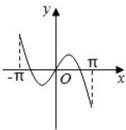
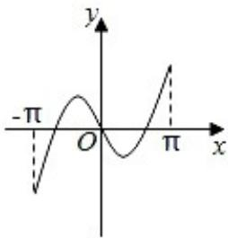
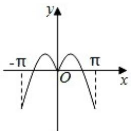
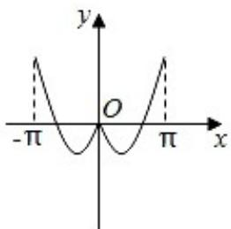

<!-- question-source:start -->
4. 函数 $y = x\cos x + \sin x$ 在区间 $[- \pi, +\pi]$ 的图象大致为（）

A.  

B.  

C.

D.

<!-- question-source:end -->

![[高中/真题/按年份分类/2020/2020年高考浙江高考数学试题及答案_精校版_/选择题/题目/answers/Q00022715A1.md]]
