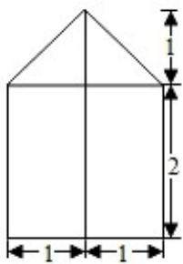

<!-- question-source:start -->
5. 某几何体的三视图（单位：cm）如图所示，则该几何体的体积（单位：cm3）是（）

  
主视图

  
侧视图

  
俯视图

A. $\frac{7}{3}$ B. $\frac{14}{3}$ C. 3 D. 6
<!-- question-source:end -->

![[高中/真题/按年份分类/2020/2020年高考浙江高考数学试题及答案_精校版_/选择题/题目/answers/Q00022716A1.md]]
