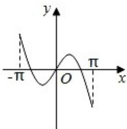
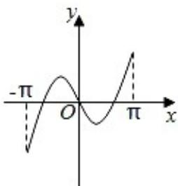
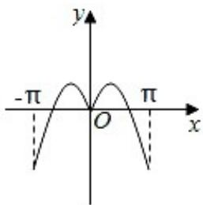
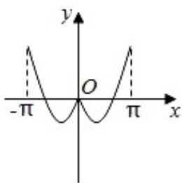
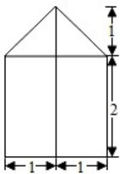
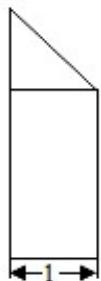
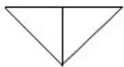

> [!faq]- 2020年高考浙江高考数学试题及答案(精校版)解析
>
> > [!success]- **【答案】** A
>
> > [!note]- **【分析】**
> > 直接利用交集的运算法则求解即可.
> > 解：集合 $P=\{x\mid1<x<4\}$ ， $Q=\{x\mid2<x<3\}$ ，
> > 则 $P \cap Q = \{x \mid 2 < x < 3\}$ .
> > 故选：B.
> > 2. 已知 $a \in \mathbb{R}$ , 若 $a - 1 + (a - 2) i$ （ $i$ 为虚数单位）是实数, 则 $a = (\quad)$ A. 1 B. -1 C. 2 D. -2
>
> > [!note]- **【解析】**
> > 【答案】已知集合 $P = \{x \mid
> > 【分析】直接利用交集的运算法则求解即可.
> > 解：集合 $P=\{x\mid1<x<4\}$ ， $Q=\{x\mid2<x<3\}$ ，
> > 则 $P \cap Q = \{x \mid 2 < x < 3\}$ .
> > 故选：B.
> >
> > 2. 已知 $a \in \mathbb{R}$ , 若 $a - 1 + (a - 2) i$ （ $i$ 为虚数单位）是实数, 则 $a = (\quad)$ A. 1 B. -1 C. 2 D. -2
> >
> > 【分析】利用复数的虚部为0，求解即可.  
> > 解： $a\in \mathbb{R}$ ，若 $a - 1 + (a - 2)i$ （ $i$ 为虚数单位）是实数，可得 $a - 2 = 0$ ，解得 $a = 2$ 故选： $C$
> >
> > 3. 若实数 $x, y$ 满足约束条件 $\left\{ \begin{array}{l} x - 3y + 1 \leqslant 0 \\ x + y - 3 \geqslant 0 \end{array} \right.$ ，则 $z = x + 2y$ 的取值范围是（）A. $(- \infty, 4]$ B. $[4, +\infty)$ C. $[5, +\infty)$ D. $(- \infty, +\infty)$
> >
> > 【分析】作出不等式组表示的平面区域；作出目标函数对应的直线；结合图象判断目标函数 $z = x + 2y$ 的取值范围.解：画出实数 $x, y$ 满足约束条件 $\left\{ \begin{array}{l} x - 3y + 1 \leqslant 0 \\ x + y - 3 \geqslant 0 \end{array} \right.$ 所示的平面区域，如图：将目标函数变形为 $-\frac{1}{2} x + \frac{z}{2} = y,$ 则 $z$ 表示直线在 $y$ 轴上截距，截距越大， $z$ 越大，当目标函数过点 $A(2,1)$ 时，截距最小为 $z = 2 + 2 = 4$ ，随着目标函数向上移动截距越来越大，
> >
> > 故目标函数 $z=2x+y$ 的取值范围是 $[4, +\infty)$ .
> >
> > 故选：B.
> >
> > 
> >
> > 4. 函数 $y = x\cos x + \sin x$ 在区间 $[- \Pi, +\Pi]$ 的图象大致为（）
> >
> > A.
> >
> > 
> >
> > B.
> >
> > 
> >
> > C.
> >
> > 
> >
> > D.
> >
> > 
> >
> > 【分析】先判断函数的奇偶性，再判断函数值的特点.
> >
> > 解： $y=f(x)=x\cos x+\sin x,$
> >
> > 则 $f(-x) = -x\cos x - \sin x = -f(x)$ ，
> >
> > ∴f(x)为奇函数，函数图象关于原点对称，故排除B，D，
> >
> > 当 $x=\pi$ 时， $y=f(\pi)=\pi\cos\pi+\sin\pi=-\pi<0$ ，故排除 B，
> >
> > 故选：A.
> >
> > 5. 某几何体的三视图（单位：cm）如图所示，则该几何体的体积（单位：cm3）是（）
> >
> >   
> > 主视图
> >
> > 
> >
> >   
> > 侧视图  
> > 俯视图
> >
> > A. $\frac{7}{3}$ B. $\frac{14}{3}$ C. 3 D. 6
> >
> > 【分析】画出几何体的直观图，利用三视图的数据求解几何体的体积即可.
> >
> > 解：由题意可知几何体的直观图如图，下部是直三棱柱，底面是斜边长为2的等腰直角三角形，棱锥的高为2，上部是一个三棱锥，一个侧面与底面等腰直角三角形垂直，棱锥的高为1，
> >
> > 所以几何体的体积为： $\frac{1}{2} \times 2 \times 1 \times 2 + \frac{1}{3} \times \frac{1}{2} \times 2 \times 1 \times 1 = \frac{7}{3}$ .
> >
> > 故选：A.
> >
> > 
> >
> > 6. 已知空间中不过同一点的三条直线 $m, n, l$ , 则 “ $m, n, l$ 在同一平面” 是 “ $m, n, l$ 两两相交”的（）
> > A. 充分不必要条件
> > B. 必要不充分条件
> > C. 充分必要条件
> > D. 既不充分也不必要条件
> >
> > 【分析】由 $m, n, l$ 在同一平面，则 $m, n, l$ 相交或 $m, n, l$ 有两个平行，另一直线与之相交，或三条直线两两平行，根据充分条件，必要条件的定义即可判断.
> >
> > 解: 空间中不过同一点的三条直线 m, n, l, 若 m, n, l 在同一平面, 则 m, n, l 相交或 m, n, l 有两个平行, 另一直线与之相交, 或三条直线两两平行.
> > 故 m, n, l 在同一平面”是 “m, n, l 两两相交”的必要不充分条件,
> > 故选：B.
> >
> > 7. 已知等差数列 $\{an\}$ 的前 $n$ 项和 $Sn$ ，公差 $d=0$ ， $\frac{a_1}{d} \leqslant 1$ 。记 $b1 = S2$ ， $bn+1 = Sn+2 - S2n$ ， $n \in \mathbb{N}^*$ ，下列等式不可能成立的是（）
> > A. $2a4 = a2 + a6$ B. $2b4 = b2 + b6$ C. $a42 = a2a8$ D. $b42 = b2b8$
> >
> > 【分析】由已知利用等差数列的通项公式判断 A 与 C；由数列递推式分别求得
> > b 2, b4, b6, b8，分析 B，D 成立时是否满足公差 d=0， $\frac{a_{1}}{d}\leqslant1$ 判断 B 与 D.
> >
> > $$
> > a n = a 1 + (n - 1) d,
> > $$
> >
> > $$
> > S _ {n + 2} = (n + 2) a _ {1} + \frac {(n + 2) (n + 1)}{2} d, S _ {2 n} = 2 n a _ {1} + \frac {2 n (2 n - 1)}{2} d,
> > $$
> >
> > $$
> > b 1 = S 2 = 2 a 1 + d, b n + 1 = S n + 2 - S 2 n = (2 - n) a _ {1} - \frac {3 n ^ {2} - 5 n - 2}{2} d.
> > $$
> >
> > $$
> > \therefore b 2 = a 1 + 2 d, b 4 = - a 1 - 5 d, b 6 = - 3 a 1 - 2 4 d, b 8 = - 5 a 1 - 5 5 d.
> > $$
> >
> > $$
> > . 2 a 4 = 2 (a 1 + 3 d) = 2 a 1 + 6 d, a 2 + a 6 = a 1 + d + a 1 + 5 d = 2 a 1 + 6 d
> > $$
> >
> > $$
> > B. 2 b 4 = - 2 a 1 - 1 0 d, b 2 + b 6 = a 1 + 2 d - 3 a 1 - 2 4 d = - 2 a 1 - 2 2 d,
> > $$
> >
> > $$
> > \left(a _ {1} + 3 d\right) ^ {2} = \left(a _ {1} + d\right) \left(a _ {1} + 7 d\right)
> > $$
> >
> > $$
> > a _ {1} ^ {2} + 6 a _ {1} d + 9 d ^ {2} = a _ {1} ^ {2} + 8 a _ {1} d + 7 d ^ {2}
> > $$
> >
> > $$
> > \because d = 0, \therefore a 1 = d,
> > $$
> >
> > $$
> > a _ {1} d = d ^ {2}
> > $$
> >
> > $$
> > \frac {a _ {1}}{d} \leqslant 1
> > $$
> >
> > $$
> > b _ {4} ^ {2} = b _ {2} b _ {8}
> > $$
> >
> > $$
> > (- a _ {1} - 5 d) ^ {2} = (a _ {1} + 2 d) (- 5 a _ {1} - 5 5 d)
> > $$
> >
> > $$
> > 2 \left(\frac {a _ {1}}{d}\right) ^ {2} + 2 5 \frac {a _ {1}}{d} + 4 5 = 0
> > $$
> >
> > $$
> > \begin{array}{c} \text {a} _ {1} \\ \hline \text {d} \end{array}
> > $$
> >
> > $$
> > \frac {a _ {1}}{d} \leqslant 1
> > $$
> >
> > 故选：B.
> >
> > 8. 已知点 $O(0,0), A(-2,0), B(2,0)$ . 设点 $P$ 满足 $|PA| - |PB| = 2$ , 且 $P$ 为函数 $y = 3\sqrt{4 - x^2}$ 图象上的点, 则 $|OP| = (\quad)$ A. $\frac{\sqrt{22}}{2}$ B. $\frac{4\sqrt{10}}{5}$ C. $\sqrt{7}$ D. $\sqrt{10}$
> >
> > 【分析】求出 P 满足的轨迹方程，求出 P 的坐标，即可求解 $|OP|$ .
> >
> > 解：点 $O(0,0)$ ， $A(-2,0)$ ， $B(2,0)$ 。设点 $P$ 满足 $|PA| - |PB| = 2$ ，可知 $P$ 的轨迹是双曲线 $\frac{x^2}{1} - \frac{y^2}{3} = 1$ 的右支上的点， $P$ 为函数 $y = 3\sqrt{4 - x^2}$ 图象上的点，即 $\frac{y^2}{36} + \frac{x^2}{4} = 1$ 在第一象限的点，联立两个方程，解得 $P\left(\frac{\sqrt{13}}{2}, \frac{3\sqrt{3}}{2}\right)$ ，所以 $|OP| = \sqrt{\frac{13}{4} + \frac{27}{4}} = \sqrt{10}$ .
> >
> > 故选：D.
> >
> > 9. 已知 $a, b \in \mathbb{R}$ 且 $ab = 0$ ，若 $(x - a) (x - b) (x - 2a - b) \geqslant 0$ 在 $x \geq 0$ 上恒成立，则（）
> > A. $a < 0$ B. $a > 0$ C. $b < 0$ D. $b > 0$
> >
> > 【分析】设 $f(x)=(x-a)(x-b)(x-2a-b)$ ，求得 $f(x)$ 的零点，根据 $f(0)\geqslant0$ 恒成立，讨论a，b的符号，结合三次函数的图象，即可得到结论.
> > 解：设 $f(x)=(x-a)(x-b)(x-2a-b)$ ，可得 $f(x)$ 的图象与x轴有三个交点，即 $f(x)$ 有三个零点a，b， $2a+b$ 且 $f(0)=-ab(2a+b)$ ，
> > 由题意知， $f(0)\geqslant0$ 恒成立，则 $ab(2a+b)\leqslant0,a<0,b<0,$ 可得 $2a+b<0,ab(2a+b)\leqslant0$ 恒成立，排除B，D；
> > 我们考虑零点重合的情况，即中间和右边的零点重合，左边的零点在负半轴上.
> > 则有a=b或 $a=2a+b$ 或 $b=b+2a$ 三种情况，此时a=b<0显然成立；
> > 若 $b=b+2a$ ，则a=0不成立；
> > 若 $a=2a+b$ ，即 $a+b=0$ ，可得b<0，a>0且a和 $2a+b$ 都在正半轴上，符合题意，
> > 综上b<0恒成立.
> > 故选：C.
> >
> > 10. 设集合 $S, T, S \subseteq \mathbb{N}^*$ , $T \subseteq \mathbb{N}^*$ , $S, T$ 中至少有两个元素, 且 $S, T$ 满足:  
> > ① 对于任意 $x, y \in S$ , 若 $x = y$ , 都有 $xy \in T$ ;  
> > ② 对于任意 $x, y \in T$ , 若 $x < y$ , 则 $\frac{y}{x} \in S$ ; 下列命题正确的是 ( )  
> > A. 若 $S$ 有 4 个元素, 则 $SuT$ 有 7 个元素  
> > B. 若 $S$ 有 4 个元素, 则 $SuT$ 有 6 个元素  
> > C. 若 $S$ 有 3 个元素, 则 $SuT$ 有 4 个元素  
> > D. 若 $S$ 有 3 个元素, 则 $SuT$ 有 5 个元素  
> > 【分析】利用特殊集合排除选项, 推出结果即可.
> >
> > 解：取： $S=\{1,2,4\}$ ，则 $T=\{2,4,8\}$ ， $S\cup T=\{1,2,4,8\}$ ，4个元素，排除 C. $S=\{2,4,8\}$ ，则 $T=\{8,16,32\}$ ， $S\cup T=\{2,4,8,16,32\}$ ，5个元素，排除 D； $S=\{2,4,8,16\}$ 则 $T=\{8,16,32,64,128\}$ ， $S\cup T=\{2,4,8,16,32,64,128\}$ ，7个元素，排除 B;
> > 故选：A.
