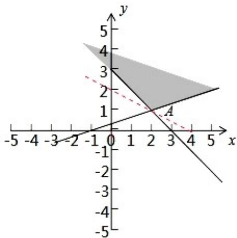

> [!faq]- 2020年高考浙江高考数学试题及答案(精校版)解析
>
> > [!success]- **【答案】** B
>
> > [!note]- **【分析】**
> > 作出不等式组表示的平面区域；作出目标函数对应的直线；结合图象判断目标函数 $z = x + 2y$ 的取值范围.解：画出实数 $x, y$ 满足约束条件 $\left\{ \begin{array}{l} x - 3y + 1 \leqslant 0 \\ x + y - 3 \geqslant 0 \end{array} \right.$ 所示的平面区域，如图：将目标函数变形为 $-\frac{1}{2} x + \frac{z}{2} = y,$ 则 $z$ 表示直线在 $y$ 轴上截距，截距越大， $z$ 越大，当目标函数过点 $A(2,1)$ 时，截距最小为 $z = 2 + 2 = 4$ ，随着目标函数向上移动截距越来越大，
>
> > [!note]- **【解析】**
> > 【分析】作出不等式组表示的平面区域；作出目标函数对应的直线；结合图象判断目标函数 $z = x + 2y$ 的取值范围.解：画出实数 $x, y$ 满足约束条件 $\left\{ \begin{array}{l} x - 3y + 1 \leqslant 0 \\ x + y - 3 \geqslant 0 \end{array} \right.$ 所示的平面区域，如图：将目标函数变形为 $-\frac{1}{2} x + \frac{z}{2} = y,$ 则 $z$ 表示直线在 $y$ 轴上截距，截距越大， $z$ 越大，当目标函数过点 $A(2,1)$ 时，截距最小为 $z = 2 + 2 = 4$ ，随着目标函数向上移动截距越来越大，
> >
> > 故目标函数 $z=2x+y$ 的取值范围是 $[4, +\infty)$ .
> >
> > 故选：B.
> >
> > 
