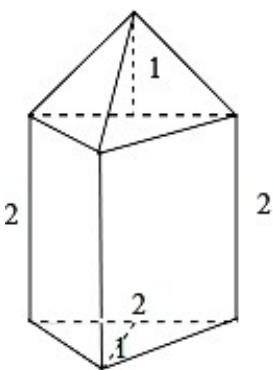

> [!faq]- 2020年高考浙江高考数学试题及答案(精校版)解析
>
> > [!success]- **【答案】** A
>
> > [!note]- **【分析】**
> > 画出几何体的直观图，利用三视图的数据求解几何体的体积即可.
>
> > [!note]- **【解析】**
> > 分析】画出几何体的直观图，利用三视图的数据求解几何体的体积即可.
> >
> > 解：由题意可知几何体的直观图如图，下部是直三棱柱，底面是斜边长为2的等腰直角三角形，棱锥的高为2，上部是一个三棱锥，一个侧面与底面等腰直角三角形垂直，棱锥的高为1，
> >
> > 所以几何体的体积为： $\frac{1}{2} \times 2 \times 1 \times 2 + \frac{1}{3} \times \frac{1}{2} \times 2 \times 1 \times 1 = \frac{7}{3}$ .
> >
> > 故选：A.
> >
> > 
