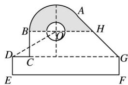

<!-- question-source:start -->
15.某中学开展劳动实习，学生加工制作零件，零件的截面如图所示．O为圆孔及轮廓圆弧AB所在圆的圆心，A是圆弧AB与直线AG的切点，B是圆弧AB与直线BC的切点，四边形DEFG为矩形， $BC \perp DG$ ，垂足为C， $\tan\angle ODC=$ ， $BH\|DG$ ，EF=12cm，DE=2cm，A到直线DE和EF的距离均为7cm，圆孔半径为1cm，则图中阴影部分的面积为\_\_\_\_cm².

<!-- question-source:end -->

![[高中/真题/按年份分类/2020/2020年高考真题数学_新高考全国Ⅰ卷__山东卷__含解析版_/填空题/题目/answers/Q00022129A1.md]]
