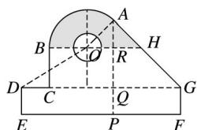

> [!faq]- 2020年高考真题数学【新高考全国Ⅰ卷】(山东卷)（含解析版）解析
>
> > [!success]- **【答案】** 4+
>
> > [!note]- **【分析】**
> > 本题未单列分析。
>
> > [!note]- **【解析】**
> > 如图，连接 OA，过 A 作 $AP \perp EF$ ，
> >
> > 
> >
> > 分别交 EF, DG, OH 于点 P, Q, R.
> >
> > 由题意知 $AP = EP = 7$ 又 $DE = 2$ ， $EF = 12$ 所以 $AQ = QG = 5$ 所以 $\angle AHO = \angle AGQ =$ 因为 $OA\bot AH$ ，所以 $\angle AOH =$ ， $\angle AOB =$ 设 $AR = x$ ，则 $OR = x$ ， $RQ = 5 - x$ 因为 $\tan \angle ODC =$ 所以 $\tan \angle ODC = =$ 解得 $x = 2$ ，则 $OA = 2$ 所以 $S = S_{扇形AOB} + S_{\triangle AOH} - S_{小半圆}$ $= \times \times (2)^{2} + \times 4\times 2 - \pi \times 1^{2}$ $= cm^2.$
