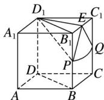

> [!faq]- 2020年高考真题数学【新高考全国Ⅰ卷】(山东卷)（含解析版）解析
>
> > [!success]- **【答案】** 详见解析
>
> > [!note]- **【分析】**
> > 本题未单列分析。
>
> > [!note]- **【解析】**
> > 如图，设 $B_{1}C_{1}$ 的中点为 E，
> >
> > 
> >
> > 球面与棱 $BB_{1}$ ， $CC_{1}$ 的交点分别为 P，Q，
> >
> > 连接 DB， $D_{1}B_{1}$ ， $D_{1}P$ ， $D_{1}E$ ，EP，EQ，
> >
> > 由 $\angle BAD = 60^{\circ}$ ， $AB = AD$ ，知 $\triangle ABD$ 为等边三角形，
> >
> > $$
> > \therefore D _ {1} B _ {1} = D B = 2
> > $$
> >
> > $\therefore\triangle D_{1}B_{1}C_{1}$ 为等边三角形，
> >
> > 则 $D_{1}E=$ 且 $D_{1}E\perp$ 平面 $BCC_{1}B_{1}$ ,
> >
> > $\therefore E$ 为球面截侧面 $BCC_{1}B_{1}$ 所得截面圆的圆心，
> >
> > 设截面圆的半径为 r，
> >
> > 则 $r = = =$
> >
> > 又由题意可得 $EP = EQ =$
> >
> > ∴球面与侧面 $BCC_{1}B_{1}$ 的交线为以 E 为圆心的圆弧 PQ.
> >
> > 又 $D_{1}P =$
> >
> > $\therefore B_{1}P = = 1$
> >
> > 同理 $C_{1}Q=1$ ,
> >
> > $\therefore P, Q$ 分别为 $BB_{1}, CC_{1}$ 的中点，
> >
> > $\therefore \angle PEQ =$
> >
> > 知 $\bar{P}Q$ 的长为×=，即交线长为.
> >
> > ##
