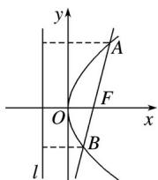

> [!faq]- 2020年高考真题数学【新高考全国Ⅰ卷】(山东卷)（含解析版）解析
>
> > [!success]- **【答案】** 详见解析
>
> > [!note]- **【分析】**
> > 本题未单列分析。
>
> > [!note]- **【解析】**
> > 如图，由题意得，抛物线焦点为 $F(1,0)$ ，
> >
> > 
> >
> > 设直线 AB 的方程为 $y=(x-1)$ .
> >
> > 由
> >
> > 得 $3x^{2}-10x+3=0$ .
> >
> > 设 $A(x_{1}, y_{1})$ ， $B(x_{2}, y_{2})$ ，
> >
> > 则 $x_{1} + x_{2} =$
> >
> > 所以 $|AB|=x_{1}+x_{2}+2=$ .
