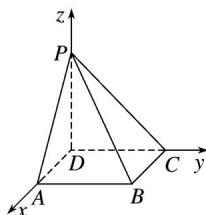

<!-- question-source:start -->
20.如图，四棱锥 $P - ABCD$ 的底面为正方形， $PD \perp$ 底面ABCD.设平面PAD与平面PBC的交线为 $l$ .

(1)证明： $l \perp$ 平面 PDC;

(2)已知 $PD = AD = 1$ ， $Q$ 为 $l$ 上的点，求 $PB$ 与平面 $QCD$ 所成角的正弦值的最大值.

(1)证明 在正方形 ABCD 中， $AD \parallel BC$ ，

因为 $AD \notin$ 平面 PBC， $BC \subset$ 平面 PBC，

所以 $AD \parallel$ 平面 $PBC$ ,

又因为 $AD \subset$ 平面 PAD，平面 $PAD \cap$ 平面 PBC = l，

所以 $AD\| l$

因为在四棱锥 P-ABCD 中，底面 ABCD 是正方形，

所以 $AD \perp DC$ ，所以 $l \perp DC$ ，

且 $PD \perp$ 平面 ABCD，所以 $AD \perp PD$ ，所以 $l \perp PD$ ，

因为 $DC \cap PD = D,$

所以 $l \perp$ 平面 PDC.

(2)解 以 $D$ 为坐标原点，DA的方向为 $x$ 轴正方向，如图建立空间直角坐标系 $D - xyz$

因为 PD=AD=1，则有 $D(0,0,0)$ ， $C(0,1,0)$ ， $A(1,0,0)$ ， $P(0,0,1)$ ， $B(1,1,0)$ ，

设 $Q(m,0,1)$

则有DC=(0,1,0)，DQ=(m,0,1)，PB=(1,1，-1)，

设平面 QCD 的法向量为 $\boldsymbol{n}=(x,y,z)$ ,

则即

令 $x = 1$ ，则 $z = -m$

所以平面 QCD 的一个法向量为 $n=(1,0,-m)$ ,

则 $\cos\langle n, PB\rangle ==.$

根据直线的方向向量与平面法向量所成角的余弦值的绝对值即为直线与平面所成角的正弦值，

所以直线 $PB$ 与平面 $QCD$ 所成角的正弦值等于

$|\cos\langle n, PB\rangle|=$

≤·≤·=，

当且仅当 $m = 1$ 时取等号，

所以直线 $PB$ 与平面 $QCD$ 所成角的正弦值的最大值为.
<!-- question-source:end -->

![[高中/真题/按年份分类/2020/2020年高考真题数学_新高考全国Ⅰ卷__山东卷__含解析版_/解答题/题目/answers/Q00022134A1.md]]
