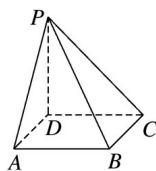

<!-- question-source:start -->
20.如图，四棱锥 $P - ABCD$ 的底面为正方形， $PD \perp$ 底面ABCD.设平面PAD与平面PBC的交线为 $l$ .

<!-- question-source:end -->

![[高中/真题/按年份分类/2020/2020年高考真题数学_新高考全国Ⅰ卷__山东卷__含解析版_/解答题/题目/answers/Q00029125A1.md]]
