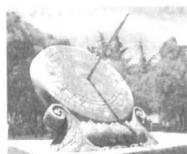

<!-- question-source:start -->
4. 日晷是中国古代用来测定时间的仪器，利用与晷面垂直的晷针投射到晷面的影子来测定时间。把地球看成一个球(球心记为 O)，地球上一点 A 的纬度是指 OA 与地球赤道所在平面所成角，点 A 处的水平面是指过点 A 且与 OA 垂直的平面。在点 A 处放置一个日晷，若晷面与赤道所在平面平行，点 A 处的纬度为北纬 $40^{\circ}$ ，则晷针与点 A 处的水平面所成角为()

A. $20^{\circ}$ B. $40^{\circ}$ C. $50^{\circ}$ D. $90^{\circ}$
<!-- question-source:end -->

![[高中/真题/按年份分类/2020/2020年高考真题数学_新高考全国Ⅰ卷__山东卷__含解析版_/选择题/题目/answers/Q00022118A1.md]]
