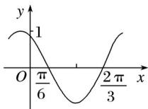

<!-- question-source:start -->
10. 如图是函数 $y = \sin (\omega x + \varphi)$ 的部分图象，则 $\sin (\omega x + \varphi)$ 等于( )

A. sin B. sin C. cos D. cos
<!-- question-source:end -->

![[高中/真题/按年份分类/2020/2020年高考真题数学_新高考全国Ⅰ卷__山东卷__含解析版_/选择题/题目/answers/Q00022124A1.md]]
