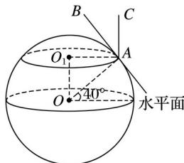

> [!faq]- 2020年高考真题数学【新高考全国Ⅰ卷】(山东卷)（含解析版）解析
>
> > [!success]- **【答案】** B
>
> > [!note]- **【分析】**
> > 本题未单列分析。
>
> > [!note]- **【解析】**
> > 如图所示， $\odot O$ 为赤道平面， $\odot O_{1}$ 为 $A$ 点处的日晷面所在的平面，
> >
> > 
> >
> > 由点 A 处的纬度为北纬 $40^{\circ}$ 可知 $\angle OAO_{1}=40^{\circ}$ ,
> >
> > 又点 A 处的水平面与 OA 垂直，晷针 AC 与 $\odot O_{1}$ 所在的面垂直，
> >
> > 则晷针 AC 与水平面所成角为 $40^{\circ}$ .
