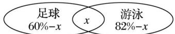

> [!faq]- 2020年高考真题数学【新高考全国Ⅰ卷】(山东卷)（含解析版）解析
>
> > [!success]- **【答案】** C
>
> > [!note]- **【分析】**
> > 本题未单列分析。
>
> > [!note]- **【解析】**
> > 用 Venn 图表示该中学喜欢足球和游泳的学生所占的比例之间的关系如图，
> >
> > 
> >
> > 设既喜欢足球又喜欢游泳的学生占该中学学生总数的比例为 $x$ ，则 $(60\% - x) + (82\% - x) + x = 96\%$ ，解得 $x = 46\%$ .
