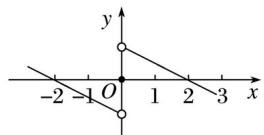
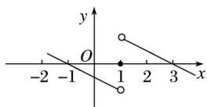

> [!faq]- 2020年高考真题数学【新高考全国Ⅰ卷】(山东卷)（含解析版）解析
>
> > [!success]- **【答案】** D
>
> > [!note]- **【分析】**
> > 本题未单列分析。
>
> > [!note]- **【解析】**
> > 因为函数 $f(x)$ 为定义在 $\mathbf{R}$ 上的奇函数，
> >
> > 则 $f(0)=0.$
> >
> > 又 $f(x)$ 在 $(-∞, 0)$ 上单调递减，且 $f(2)=0$ ，
> >
> > 画出函数 $f(x)$ 的大致图象如图(1)所示，
> >
> > 则函数 $f(x-1)$ 的大致图象如图(2)所示.
> >
> >   
> > (1)
> >
> >   
> > (2)
> >
> > 当 $x \leq 0$ 时，要满足 $xf(x-1) \geq 0$ ，则 $f(x-1) \leq 0$ ，得 $-1 \leq x \leq 0$ .
> >
> > 当 $x > 0$ 时，要满足 $xf(x - 1) \geq 0$ ，则 $f(x - 1) \geq 0$
> >
> > 得 $1 \leq x \leq 3$ .
> >
> > 故满足 $xf(x - 1)\geq 0$ 的 $x$ 的取值范围是[-1,0]U[1,3].
> >
> > ## 二、选择题(本题共4小题，每小题5分，共20分．在每小题给出的选项中，有多项符合题目要求．全部选对的得5分，有选错的得0分，部分选对的得3分)
