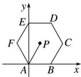

> [!faq]- 2020年高考真题数学【新高考全国Ⅰ卷】(山东卷)（含解析版）解析
>
> > [!success]- **【答案】** A
>
> > [!note]- **【分析】**
> > 本题未单列分析。
>
> > [!note]- **【解析】**
> > 如图，取 A 为坐标原点，AB 所在直线为 x 轴建立平面直角坐标系，
> >
> > 
> >
> > 则 $A(0,0)$ ， $B(2,0)$ ， $C
> > (3)$ ， $F(-1)$ 。
> >
> > 设 $P(x, y)$ ，则 $AP=(x, y)$ ， $AB=(2,0)$ ，且 -1<x<3.
> >
> > 所以AP·AB=(x, y)·(2,0)=2x∈(-2,6).
