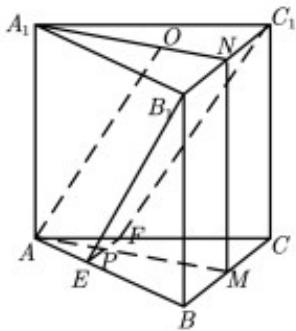

<!-- question-source:start -->
20. (12 分)

如图, 已知三棱柱 $ABC - A_{1}B_{1}C_{1}$ 的底面是正三角形, 侧面 $BB_{1}C_{1}C$ 是矩形, M, N 分别为 BC,

$B_{1}C_{1}$ 的中点，P 为 AM 上一点，过 $B_{1}C_{1}$ 和 P 的平面交 AB 于 E ，交 AC 于 F .

(1) 证明: $AA_{1} \parallel MN$ , 且平面 $A_{1}AMN \perp$ 平面 $EB_{1}C_{1}F$ ;

(2) 设 $O$ 为 $\triangle A_{1}B_{1}C_{1}$ 的中心, 若 $AO \parallel$ 平面 $EB_{1}C_{1}F$ , 且 $AO = AB$ , 求直线 $B_{1}E$ 与平面 $A_{1}AMN$ 所成角的正弦值.

<!-- question-source:end -->

![[高中/真题/按年份分类/2020/2020年高考重庆理科数学试题及答案_精校版_/解答题/题目/answers/Q00025705A1.md]]
