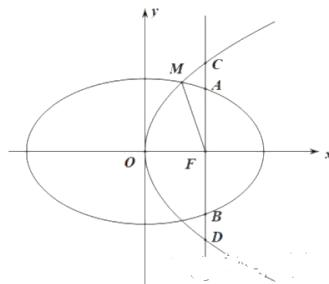

> [!faq]- 2020年高考重庆理科数学试题及答案(精校版)解析
>
> > [!success]- **【答案】** （1） $C_1$ 的离心率为 $\frac{1}{2}$ ；（2） $C_1: \frac{x^2}{36} + \frac{y^2}{27} = 1$ ， $C_2: y^2 = 12x$ ： 【
>
> > [!note]- **【分析】**
> > 本题未单列分析。
>
> > [!note]- **【解析】**
> > （1）∵F为 $C_{1}$ 的焦点且 $AB\perp x$ 轴，∴ $F(c,0)$ ， $|AB|=\frac{2b^{2}}{a}$
> >
> > 设 $C_2$ 的标准方程为 $y^{2} = 2px(p > 0)$ ， $\because F$ 为 $C_2$ 的焦点且 $AB\bot x$ 轴，
> >
> > $\therefore F(\frac{p}{2},0),\left|AB\right| = 2p.$
> >
> > $\because \left|CD\right| = \frac{4}{3}\left|AB\right|$ ， $C_1$ 与 $C_2$ 焦点重合， $\therefore \left\{ \begin{array}{l}c = \frac{p}{2}\\ 2p = \frac{4}{3}\times \frac{2b^2}{a} \end{array} \right.$
> >
> > 消去 $p$ 得： $4c = \frac{8b^2}{3a}$ ， $\therefore 3ac = 2b^2$ ， $\therefore 3ac = 2a^2 -2c^2$
> >
> > 
> >
> > 设 $C_1$ 的离心率为 $e$ ，则 $2e^{2} + 3e - 2 = 0$ ， $\therefore e = \frac{1}{2}$ 或 $e = -2$ （舍），故 $C_1$ 的离心率为 $\frac{1}{2}$
> >
> > （2）由（1）知 $a = 2c$ ， $b = \sqrt{3} c$ ， $p = 2c$ ： $\therefore C_1:\frac{x^2}{4c^2} +\frac{y^2}{3c^2} = 1$ ， $C_2:y^2 = 4cx$
> >
> > 联立两曲线方程，消去 $y$ 得 $3x^{2} + 16cx - 12c^{2} = 0$ ， $\therefore (3x - 2c)(x + 6c) = 0$
> >
> > $\therefore x = \frac{2}{3} c$ 或 $x = -6c$ （舍），从而 $\left|MF\right| = x + \frac{p}{2} = \frac{2}{3} c + c = \frac{5}{3} c = 5$ ，∴ $c = 3$
> >
> > $\therefore C_{1}$ 与 $C_2$ 的标准方程分别为 $\frac{x^2}{36} +\frac{y^2}{27} = 1$ ， $y^{2} = 12x$ ：
