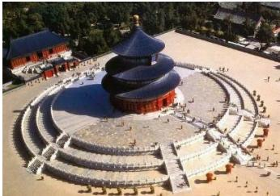
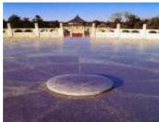

<!-- question-source:start -->
4. 北京天坛的圆丘坛为古代祭天的场所，分上、中、下三层，上层中心有一块圆形石板（称为天心石），环绕天心石砌9块扇面形石板构成第一环，向外每环依次增加9块，下一层的第一环比上一层的最后一环多9块，向外每环依次也增加9块，已知每层环数相同，且下层比中层多729块，则三层共有扇面形石板（不含天心石）

A. 3699块 B. 3474块 C. 3402块 D. 3339块
<!-- question-source:end -->

![[高中/真题/按年份分类/2020/2020年高考重庆理科数学试题及答案_精校版_/选择题/题目/answers/Q00025690A1.md]]
