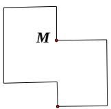
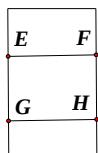
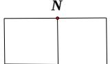

<!-- question-source:start -->
7. 右图是一个多面体的三视图，这个多面体某条棱的一个断点在正视图中对应的点为 $M$ ，在俯视图中对应的点为 $N$ ，则该端点在侧视图中对应的点为

A. $E$ B. $F$ C. $G$ D. $H$
<!-- question-source:end -->

![[高中/真题/按年份分类/2020/2020年高考重庆理科数学试题及答案_精校版_/选择题/题目/answers/Q00025693A1.md]]
