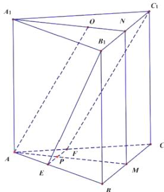

> [!faq]- 2020年高考重庆理科数学试题及答案(精校版)解析
>
> > [!success]- **【答案】** （1）见解析； （2） $\frac{\sqrt{10}}{10}$
>
> > [!note]- **【分析】**
> > 本题未单列分析。
>
> > [!note]- **【解析】**
> > （1）证明：∵M,N分别为BC,B\_{1}C\_{1}的中点，底面为正三角形
> >
> > $\therefore \mathrm{B}_{1} \mathrm{~N} = \mathrm{BM}$ ，四边形 $\mathrm{BB}_{1} \mathrm{NM}$ 为矩形， $A_{1} N \perp B_{1} C_{1}$
> >
> > $\therefore BB_{1}\| MN$ ，而 $AA_{1}\| BB_{1}$ ， $MN\perp B_1C_1$
> >
> > $\therefore AA_{1}\| MN$
> >
> > 又∵MN∩A\_{1}N=N
> >
> > 
> >
> > $\therefore$ 面 $A_{1}AMN \perp$ 面 $EB_{1}C_{1}F$
> >
> > （2）∵三棱柱上下底面平行，平面 $EB_{1}C_{1}F$ 与上下底面分别交于 $B_{1}C_{1}$ ，EF
> >
> > $\therefore EF\| B_{1}C_{1}\| BC$
> >
> > $\because AO \parallel$ 面 $EB_{1}C_{1}F, AO \subset$ 面 $AMNA_{1}$ , 面 $AMNA_{1} \cap$ 面 $EB_{1}C_{1}F = PN$
> >
> > ∴ AO∥PN, 四边形 APNO 为平行四边形
> >
> > 而 $O$ 为正三角形的中心， $AO = AB \therefore A_{1}N = 3ON, AM = 3AP, PN = BC = B_{1}C_{1} = 3EF$
> >
> > 由
> > （1）知直线 $\mathrm{B}_{1}\mathrm{E}$ 在平面 $\mathrm{A}_{1}\mathrm{AMN}$ 内的投影为PN
> >
> > 直线 $\mathrm{B_1E}$ 与平面 $\mathrm{A_1AMN}$ 所成角即为等腰梯形 $\mathrm{EFC_1B_1}$ 中 $\mathrm{B_1E}$ 与PN所成角
> >
> > 在等腰梯形 $\mathrm{EFC}_1\mathrm{B}_1$ 中，令 $\mathrm{EF} = 1$ ，过E作 $EH\perp B_1C_1$ 于H，则
> >
> > $$
> > P N = B _ {1} C _ {1} = E H = 3, B _ {1} H = 1, B _ {1} E = \sqrt {1 0}
> > $$
> >
> > $$
> > \sin \angle B _ {1} E H = \frac {B _ {1} H}{B _ {1} E} = \frac {\sqrt {1 0}}{1 0}
> > $$
> >
> > 所以直线 $\mathrm{B_1E}$ 与平面 $\mathrm{A_1AMN}$ 所成角的正弦值为 $\frac{\sqrt{10}}{10}$
