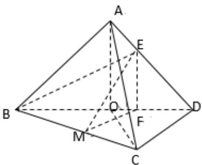

> [!faq]- 2解析
>
> > [!success]- **【答案】** (1)详见
>
> > [!note]- **【分析】**
> > （1）根据面面垂直性质定理得AO⊥平面BCD，即可证得结果；
> > (2) 先作出二面角平面角, 再求得高, 最后根据体积公式得结果.
>
> > [!note]- **【解析】**
> > （1）因为AB=AD,O为BD中点，所以AO⊥BD
> >
> > 因为平面ABD∩平面BCD=BD,平面ABD⊥平面BCD，AO⊂平面ABD,
> >
> > 因此AO⊥平面BCD，
> >
> > 因为 $CD \subset$ 平面BCD，所以 $\mathrm{AO} \perp \mathrm{CD}$
> > (2)作EF⊥BD于F, 作FM⊥BC于M,连FM
> >
> > 因为AO⊥平面BCD，所以AO⊥BD, AO⊥CD
> >
> > 所以EF⊥BD, EF⊥CD, BD∩CD=D, 因此EF⊥平面BCD, 即EF⊥BC
> >
> > 因为FM⊥BC， $FM \cap EF = F$ ，所以BC⊥平面EFM，即BC⊥MF
> >
> > 则 $\angle EMF$ 为二面角E-BC-D的平面角， $\angle EMF = \frac{\pi}{4}$
> >
> > 因为 BO = OD, $\triangle OCD$ 为正三角形, 所以 $\triangle OCD$ 为直角三角形
> >
> > 因为 $BE = 2ED$ ， $\therefore FM = \frac{1}{2} BF = \frac{1}{2} (1 + \frac{1}{3}) = \frac{2}{3}$
> >
> > 从而EF=FM= $\frac{2}{3}\therefore AO=1$
> >
> > ∵ AO ⊥ 平面BCD,
> >
> > 所以 $V=\frac{1}{3}AO\cdot S_{\Delta BCD}=\frac{1}{3}\times1\times\frac{1}{2}\times1\times\sqrt{3}=\frac{\sqrt{3}}{6}$
> >
> > 
> >
> > 【点睛】二面角的求法：一是定义法，二是三垂线定理法，三是垂面法，四是投影法.
