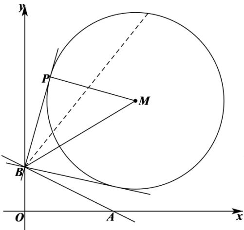

> [!faq]- 2解析
>
> > [!success]- **【答案】** ACD
>
> > [!note]- **【分析】**
> > 计算出圆心到直线 AB 的距离，可得出点 P 到直线 AB 的距离的取值范围，可判断 AB 选项的正误；
>
> > [!note]- **【解析】**
> > 圆 $(x-5)^{2}+(y-5)^{2}=16$ 的圆心为 $M(5,5)$ ，半径为4，
> >
> > 直线 AB 的方程为 $\frac{x}{4} + \frac{y}{2} = 1$ ，即 $x + 2y - 4 = 0$ ，
> >
> > $$
> > \frac {\left| 5 + 2 \times 5 - 4 \right|}{\sqrt {1 ^ {2} + 2 ^ {2}}} = \frac {1 1}{\sqrt {5}} = \frac {1 1 \sqrt {5}}{5} > 4
> > $$
> >
> > 所以，点 P 到直线 AB 的距离的最小值为 $\frac{11\sqrt{5}}{5}-4<2$ ，最大值为 $\frac{11\sqrt{5}}{5}+4<10$ ，A选项正确，B选项错误；
> >
> > 如下图所示:
> >
> > 
> >
> > 当 $\angle PBA$ 最大或最小时， $PB$ 与圆 $M$ 相切，连接 $MP$ 、 $BM$ ，可知 $PM \perp PB$ ，
> >
> > $\left|BM\right| = \sqrt{\left(0 - 5\right)^2 + \left(2 - 5\right)^2} = \sqrt{34}$ ， $|MP| = 4$ ，由勾股定理可得 $\left|BP\right| = \sqrt{\left|BM\right|^2 - \left|MP\right|^2} = 3\sqrt{2}$ ，CD选项正确.
> >
> > 故选：ACD.
> >
> > 【点睛】结论点睛：若直线 l 与半径为 r 圆 C 相离，圆心 C 到直线 l 的距离为 d，则圆 C 上一点 P 到直线 l 的距离的取值范围是 $\left[d-r, d+r\right]$ .
