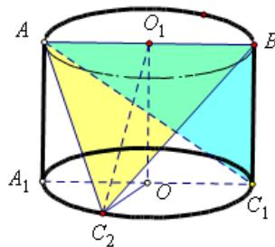

> [!faq]- 2021年上海市夏季高考数学试卷解析
>
> > [!success]- **【答案】** 详见解析
>
> > [!note]- **【分析】**
> > 本题未单列分析。
>
> > [!note]- **【解析】**
> > 由题意，当点 C 在下底底面圆弧上的运动时， $\Delta ABC$ 的底边 AB = 2，
> >
> > 所以， $\Delta ABC$ 面积的取值与高 $C_2O_1$ 相关；
> >
> > 当 $C_2O \perp A_1C_1$ 时， $C_2O_1$ 最大为： $C_2O_1 = \sqrt{1^2 + 2^2} = \sqrt{5}$ ， $\Delta ABC$ 面积的最
> >
> > 
> >
> > 大值为： $\frac{1}{2}\times2\times\sqrt{5}=\sqrt{5}$ ;
> >
> > 当 $AB \perp BC_{1}$ 时， $C_{2}O_{1}$ 最小为： $BC_{1}=2$ ， $\Delta ABC$ 面积的最大值为： $\frac{1}{2}\times2\times2=2$ ；
> >
> > 所以， $\Delta ABC$ 面积的取值范围为： $[2,\sqrt{5}]$ ;
> >
> > 【归纳总结】本题主要考查了圆柱的几何性质, 简单的数学建模 (选择求三角形面积的方案), 等价转化思想。
