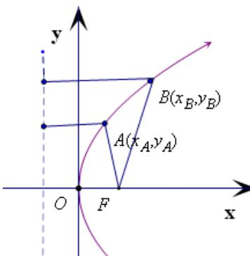
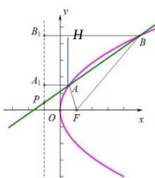

> [!faq]- 2021年上海市夏季高考数学试卷解析
>
> > [!success]- **【答案】** 31; 【
>
> > [!note]- **【分析】**
> > 注意理解与应用抛物线的定义以及直线斜率公式的特征；
>
> > [!note]- **【解析】**
> > 方法一：如图，设 $A(x_{1}, y_{1})$ ， $B(x_{2}, y_{2})$ ，再由抛物线的定义结合题设得
> >
> > $|AF| = x_1 + \frac{p}{2} = 2$ ， $|BF| = x_2 + \frac{p}{2} = 4$ ，则 $x_{2} - x_{1} = 2$
> >
> > 又 $|AB|=\sqrt{(x_{2}-x_{1})^{2}+(y_{2}-y_{1})^{2}}=3$ ，解得 $y_{2}-y_{1}=\sqrt{5}$
> >
> > 
> >
> > 
> >
> > 则直线 $AB$ 的斜率为： $\frac{y_2 - y_1}{x_2 - x_1} = \frac{\sqrt{5}}{2}$
> >
> > 方法二：过 A、B 分别向准线引垂线，垂足为 $A_{1}$ 、 $B_{1}$ ，
> >
> > 直线 AB 与 x 轴的交点为 P，
> >
> > 由抛物线定义，得 $AA_{1}=2$ ， $BB_{1}=4$ ， $AH\perp BB_{1}$ 于 H，
> >
> > 则 $BN = BB_{1} - HB_{1} = BB_{1} - AA_{1} = 2$ ，又由已知 $\mid AB\mid = 3$ ，则 $\mid AH\mid = \sqrt{5}$
> >
> > 结合平面几何中，“内错角相等”，所以，直线 $AB$ 的斜率为： $\tan \angle BPF = \tan \angle ABH = \frac{\sqrt{5}}{2}$
> >
> > 方法三：：结合本题是填充题的特点，数形结合并利用“二级结论”，弦长公式 $\sqrt{1 + k^2} |x_2 - x_1| = 3$ 即 $\sqrt{1 + k^2}\times 2 = 3$ ，解得 $k = \pm \frac{\sqrt{5}}{2}$ ，结合题设与图像 $k > 0$ ，所以 $k = \frac{\sqrt{5}}{2})$
> >
> > 【归纳总结】本题主要考查直线与圆锥曲线的位置关系，属于
